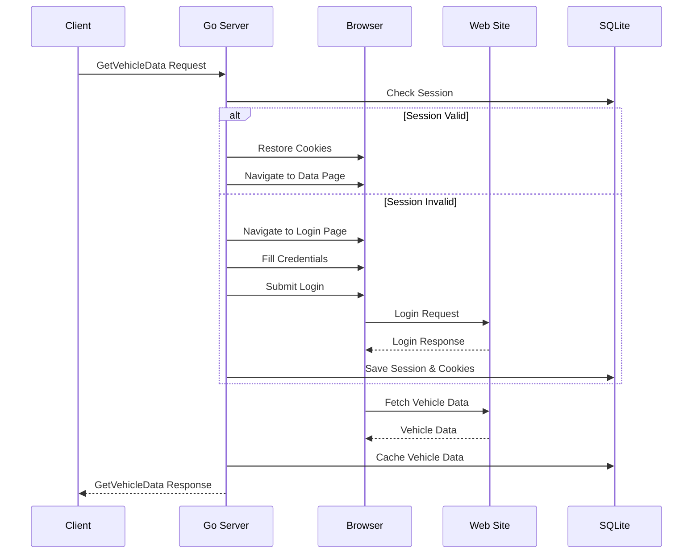

# Browser Render Go - システム仕様書

## 1. システム概要

### 1.1 目的
Cloudflare Workerで実装されているPuppeteerベースのWebスクレイピングシステムを、Go言語でgRPCサービスとして再実装する。

### 1.2 主要機能
- Webブラウザの自動操作によるデータ取得
- gRPCとHTTP両方のインターフェース提供
- セッション管理とCookie永続化
- 車両データの取得と処理

## 2. アーキテクチャ

### 2.1 システム構成
```
┌─────────────────┐     gRPC/HTTP    ┌─────────────────┐
│  Worker.js      │◄─────────────────►│  Go Server      │
│  (Client)       │                   │  (gRPC+HTTP)    │
└─────────────────┘                   └─────────────────┘
                                              │
                                              ▼
                                       ┌─────────────────┐
                                       │  Browser        │
                                       │  (Rod/Chromedp) │
                                       └─────────────────┘
                                              │
                                              ▼
                                       ┌─────────────────┐
                                       │  SQLite DB      │
                                       │  (KV Storage)   │
                                       └─────────────────┘
```

### 2.2 技術スタック
- **言語**: Go 1.21+
- **RPC**: gRPC with Protocol Buffers
- **HTTP**: gRPC-Gateway
- **ブラウザ自動化**: Rod or Chromedp
- **データベース**: SQLite
- **ビルドツール**: buf (Protocol Buffers)

## 3. API仕様

### 3.1 Protocol Buffers定義

```protobuf
syntax = "proto3";

package browser_render.v1;

option go_package = "github.com/yourusername/browser_render_go/gen/proto/v1;browserv1";

service BrowserRenderService {
  // 車両データを取得
  rpc GetVehicleData(GetVehicleDataRequest) returns (GetVehicleDataResponse);

  // セッション状態を確認
  rpc CheckSession(CheckSessionRequest) returns (CheckSessionResponse);

  // セッションをクリア
  rpc ClearSession(ClearSessionRequest) returns (ClearSessionResponse);
}

// リクエスト/レスポンスメッセージ
message GetVehicleDataRequest {
  string branch_id = 1;    // ブランチID（デフォルト: "00000000"）
  string filter_id = 2;    // フィルターID（デフォルト: "0"）
  bool force_login = 3;    // 強制ログインフラグ
}

message GetVehicleDataResponse {
  string status = 1;              // 処理ステータスメッセージ
  int32 status_code = 2;          // HTTPステータスコード
  repeated VehicleData data = 3;  // 車両データリスト
  string session_id = 4;          // セッションID
}

message VehicleData {
  string vehicle_cd = 1;           // 車両コード
  string vehicle_name = 2;         // 車両名
  string status = 3;               // 車両ステータス
  map<string, string> metadata = 4; // その他メタデータ
}

message CheckSessionRequest {
  string session_id = 1;
}

message CheckSessionResponse {
  bool is_valid = 1;
  string message = 2;
}

message ClearSessionRequest {
  string session_id = 1;
}

message ClearSessionResponse {
  bool success = 1;
  string message = 2;
}
```

### 3.2 HTTPエンドポイント

| メソッド | パス | 説明 |
|---------|------|------|
| POST | /v1/vehicle/data | 車両データ取得 |
| GET | /v1/session/check | セッション確認 |
| DELETE | /v1/session/clear | セッションクリア |
| GET | /health | ヘルスチェック |
| GET | /metrics | メトリクス取得 |

## 4. データモデル

### 4.1 SQLiteスキーマ

```sql
-- セッション管理テーブル
CREATE TABLE sessions (
    id TEXT PRIMARY KEY,
    created_at TIMESTAMP DEFAULT CURRENT_TIMESTAMP,
    updated_at TIMESTAMP DEFAULT CURRENT_TIMESTAMP,
    expires_at TIMESTAMP,
    user_id TEXT,
    company_id TEXT
);

-- Cookie管理テーブル
CREATE TABLE cookies (
    id INTEGER PRIMARY KEY AUTOINCREMENT,
    session_id TEXT,
    name TEXT NOT NULL,
    value TEXT NOT NULL,
    domain TEXT,
    path TEXT,
    expires_at TIMESTAMP,
    http_only BOOLEAN DEFAULT 0,
    secure BOOLEAN DEFAULT 0,
    FOREIGN KEY (session_id) REFERENCES sessions(id)
);

-- 車両データキャッシュテーブル
CREATE TABLE vehicle_cache (
    vehicle_cd TEXT PRIMARY KEY,
    data TEXT NOT NULL, -- JSON形式で保存
    cached_at TIMESTAMP DEFAULT CURRENT_TIMESTAMP,
    expires_at TIMESTAMP
);

-- KVストア互換テーブル
CREATE TABLE kv_store (
    key TEXT PRIMARY KEY,
    value TEXT NOT NULL,
    created_at TIMESTAMP DEFAULT CURRENT_TIMESTAMP,
    updated_at TIMESTAMP DEFAULT CURRENT_TIMESTAMP,
    ttl INTEGER -- TTL in seconds
);
```

## 5. ブラウザ操作フロー

### 5.1 ログインシーケンス



### 5.2 エラーハンドリング

| エラーケース | 処理 |
|-------------|------|
| ブラウザ起動失敗 | リトライ（最大3回） |
| ログイン失敗 | セッションクリア＆再ログイン |
| タイムアウト | エラーレスポンス返却 |
| セレクタ不在 | スクリーンショット取得＆ログ |

## 6. 設定管理

### 6.1 環境変数

```bash
# 認証情報
USER_NAME=username
COMP_ID=company_id
USER_PASS=password

# サーバー設定
GRPC_PORT=50051
HTTP_PORT=8080

# ブラウザ設定
BROWSER_HEADLESS=true
BROWSER_TIMEOUT=30000
BROWSER_DEBUG=false

# データベース
SQLITE_PATH=./data/browser_render.db

# セッション設定
SESSION_TTL=600000  # 10分（ミリ秒）
COOKIE_TTL=86400    # 1日（秒）
```

### 6.2 設定ファイル (config.yaml)

```yaml
server:
  grpc_port: 50051
  http_port: 8080
  max_connections: 100
  request_timeout: 30s

browser:
  headless: true
  window_width: 1920
  window_height: 1080
  user_agent: "Mozilla/5.0 (Windows NT 10.0; Win64; x64) AppleWebKit/537.36"
  max_instances: 5
  instance_timeout: 10m

database:
  path: "./data/browser_render.db"
  max_open_conns: 10
  max_idle_conns: 5
  conn_max_lifetime: 1h

logging:
  level: "info"
  format: "json"
  output: "stdout"

metrics:
  enabled: true
  path: "/metrics"
```

## 7. セキュリティ

### 7.1 認証・認可
- 環境変数による認証情報管理
- TLS/SSL通信の実装
- APIキー認証（将来実装）

### 7.2 データ保護
- 認証情報の暗号化保存
- セッションの適切な有効期限管理
- SQLiteデータベースの暗号化（オプション）

## 8. モニタリング

### 8.1 メトリクス
- リクエスト数/レスポンス時間
- ブラウザインスタンス数
- エラー率
- セッションヒット率

### 8.2 ログ
- 構造化ログ（JSON形式）
- ログレベル管理
- エラートレース

## 9. デプロイメント

### 9.1 ビルド
```bash
# Protocol Buffers生成
buf generate

# Goバイナリビルド
go build -o browser_render ./src

# Dockerイメージ
docker build -t browser-render:latest .
```

### 9.2 実行環境
- Linux (Ubuntu 20.04+, CentOS 8+)
- Windows Server 2019+
- Docker/Kubernetes対応

## 10. テスト戦略

### 10.1 テストカテゴリ
- 単体テスト（Unit Tests）
- 統合テスト（Integration Tests）
- E2Eテスト（End-to-End Tests）
- 負荷テスト（Load Tests）

### 10.2 カバレッジ目標
- コードカバレッジ: 80%以上
- 重要パス: 100%

## 11. 制限事項と今後の課題

### 11.1 現在の制限
- 同時ブラウザインスタンス数の制限
- 単一データベースファイル
- 水平スケーリング未対応

### 11.2 将来の拡張
- bufconnによるマイクロサービス連携
- 分散キャッシュ（Redis等）
- Kubernetes対応のステートレス化
- WebSocket対応